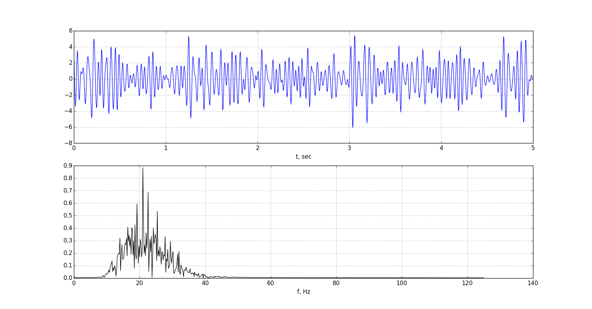
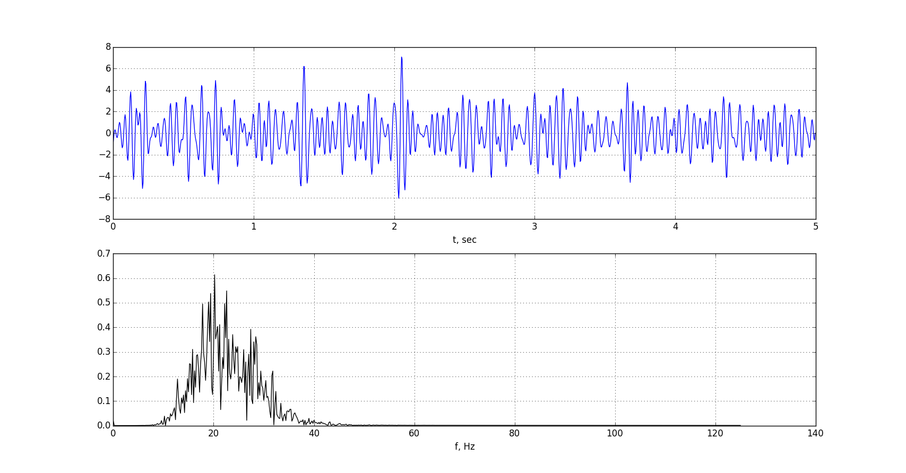
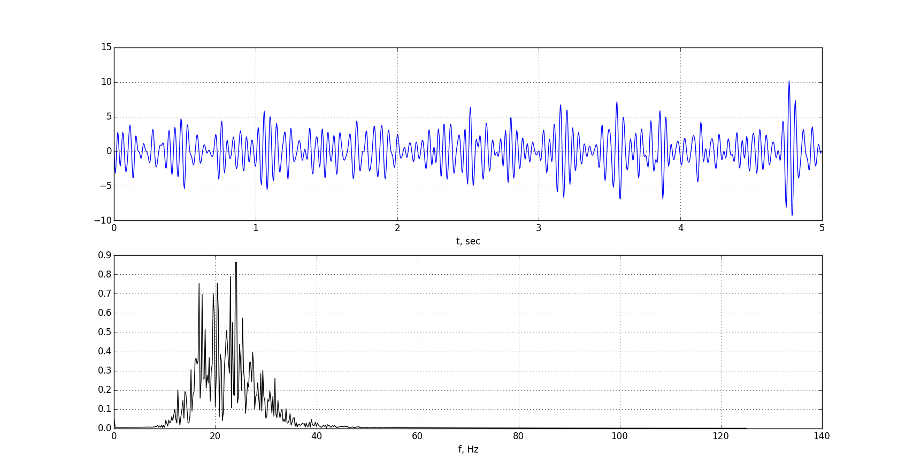

# EEG periodogram. Analysis of biomedical data.

## Description

We could call this signal from a biological or medical source - just simple a biosignal. 
The biosignal could be at the molecular level, cell level, or a systemic or organ level. 

>Examples include the electrocardiogram (ECG), or electrical activity from the heart; speech signals;
the electroencephalogram (EEG), or electrical activity from the brain; evoked potentials (EPs, i.e.,
auditory, visual, somatosensory, etc.), or electrical responses of the brain to specific peripheral
stimulation; the electroneurogram, or field potentials from local regions in the brain; action potential
signals from individual neurons or heart cells; the electromyogram (EMG), or electrical activity from
the muscle; the electroretinogram from the eye; and so on.

We are going to use real [EEG data](https://github.com/rcv911/periodogram/tree/master/data%20files) from one subject.

## Motivation

Analysis of biosignals is one of the most important thing now. Doctors doesn't have skills in programming languages, 
but they know a lot about medical things. Programmers can solve this problem, creating tools for doctors and helping them with detecting or 
estimating quickly. 
 
>Clinically, biomedical signals are primarily acquired for monitoring (detecting or estimating)
specific pathological/physiological states for purposes of diagnosis and evaluating therapy. In some
cases of basic research, they are also used for decoding and eventual modeling of specific biological
systems. 

## Results

Here's EEG time series and EEG spectrum from different 5 sec records. Number of record: 7, 21 and 50. 

Look at the spectrum. It has fluctuations of 13-40 Hz, so you can see [betta waves.](https://en.wikipedia.org/wiki/Beta_wave)
It's just simple example. If we talk about statistic data or how it helps in diagnostic we cannot use this data. 
First of all we need to average 84 records. [See this repository](https://github.com/rcv911/spectrum-average)

## Learn more

- [Wiki](https://en.wikipedia.org/wiki/Electroencephalography)
- You can use [scipy.signal.periodogram](https://docs.scipy.org/doc/scipy-0.13.0/reference/generated/scipy.signal.periodogram.html#scipy-signal-periodogram)

## Installation

You can use [Python](https://www.python.org/) with data package: [Anaconda](https://www.anaconda.com/) or [Miniconda](https://conda.io/miniconda).
There's another way - use [Portable Python](http://portablepython.com/). Also you can use whatever IDE for Python.

## License

Free
